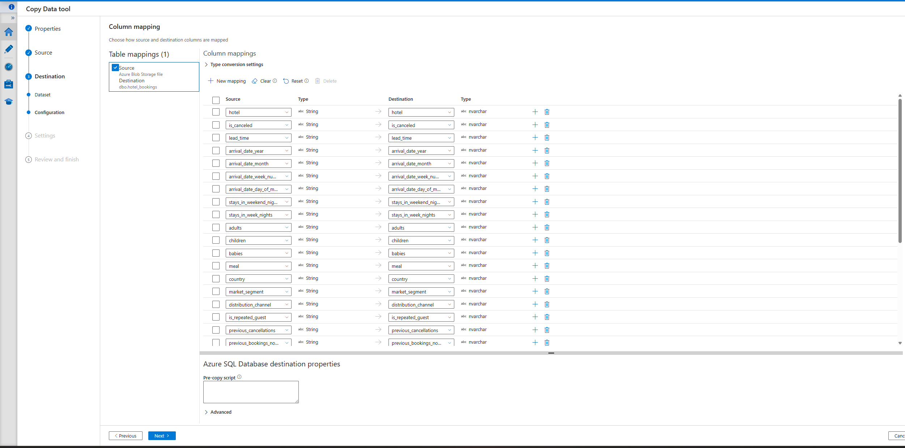
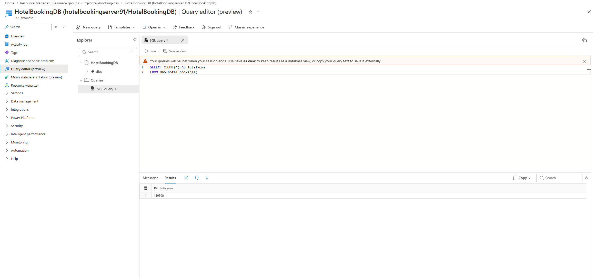

# Hotel Booking Analysis Dashboard

## Overview

Designed and implemented an end-to-end cloud analytics solution using Azure Data Factory, Azure SQL Database, and Power BI.

This project ingests raw hotel booking data, automates ETL workflows, transforms and models data through SQL reporting views, and delivers interactive business intelligence dashboards for operational and revenue analysis.

The solution demonstrates cloud-based data engineering, SQL development, data modeling, and business intelligence reporting using Microsoft Azure technologies.

---

## Dashboard Preview

### Hotel Booking Performance Dashboard


---

## Architecture

```text
Raw Hotel Booking Data
        │
        ▼
Azure Data Factory
        │
        ▼
Azure SQL Database
        │
        ▼
SQL Views & Transformations
        │
        ▼
Power BI Dashboard
```

---

## Technologies Used

- Azure Data Factory (ADF)
- Azure SQL Database
- T-SQL
- Power BI
- DAX
- Git
- GitHub

---

## Data Engineering

### Azure Data Factory

The Azure Data Factory pipeline was used to automate data ingestion and loading processes.

Key tasks included:

- Importing hotel booking data into Azure SQL Database
- Managing cloud-based ETL workflows
- Validating successful pipeline execution
- Supporting downstream reporting and analytics

### Azure Data Factory Pipeline



---

## Azure SQL Database

The hotel booking dataset was transformed and modeled using T-SQL views designed specifically for reporting and dashboard consumption.

### Reporting Views Created

| View | Purpose |
|--------|---------|
| vw_hotel_bookings_clean | Cleans and standardizes source data |
| vw_dashboard_bookings | Dashboard reporting dataset |
| vw_monthly_bookings | Monthly booking aggregation |
| vw_monthly_booking_trends | Trend analysis |
| vw_monthly_booking_trends_sorted | Sorted trend reporting |
| vw_revenue_summary | Revenue calculations |
| vw_cancellation_summary | Cancellation analysis |
| vw_country_summary | Country-level reporting |
| vw_kpi_summary | Executive KPI metrics |

### SQL Validation



---

## Data Transformation

The project included multiple data preparation and transformation processes:

- Data type conversion using TRY_CAST
- Revenue calculations
- Average Daily Rate (ADR) analysis
- Cancellation metrics
- Guest and stay calculations
- Monthly trend analysis
- Country-level aggregation
- KPI generation for dashboard reporting

---

## Power BI Dashboard

The Power BI dashboard provides business users with an interactive view of hotel performance metrics.

### Key Performance Indicators (KPIs)

- Total Bookings
- Cancelled Bookings
- Cancellation Rate

### Visualizations

- Revenue by Hotel
- ADR by Hotel
- Monthly Booking Trends
- Country-Level Booking Analysis
- Cancellation Analysis

### Interactive Features

- Hotel slicers
- Dynamic filtering
- DAX measures
- KPI cards
- Trend analysis visuals

---

## Key Business Findings

- City Hotels generated significantly higher revenue than Resort Hotels.
- Peak booking demand occurred during summer months.
- Cancellation rates exceeded one-third of total bookings.
- Average Daily Rate (ADR) varied across hotel segments.
- Booking patterns showed clear seasonal trends that could support forecasting and capacity planning.

---

## Project Structure

```text
HotelBookingAnalysis
│
├── Documentation
│   ├── ProjectArchitecture.md
│   └── ProjectSummary.md
│
├── PowerBI
│   └── Hotel Booking Performance Dashboard.pbix
│
├── Raw Data File
│   └── hotel_bookings.csv
│
├── Screenshots
│   ├── 01_AzureDataFactory_Copy_Activity.png
│   ├── 02_adf_pipeline_success.png
│   ├── 03_sql_row_count_verification.png
│   ├── 04_clean_sql_view.png
│   ├── 05_cancellation_analysis_view.png
│   ├── 06_revenue_analysis_view.png
│   ├── 07_Cancellation_summary_by_country.png
│   ├── 08_monthly_booking_trends.png
│   ├── 09_Monthly_trends_sorted.png
│   └── Hotel Booking Performance Dashboard.png
│
├── SQL
│   ├── 01_vw_hotel_bookings_clean.sql
│   ├── 02_Create_Dashboard_View.sql
│   ├── 03_vw_monthly_bookings.sql
│   ├── 04_vw_monthly_booking_trends.sql
│   ├── 05_vw_monthly_booking_trends_sorted.sql
│   ├── 06_vw_revenue_summary.sql
│   ├── 07_vw_cancellation_summary.sql
│   ├── 08_vw_country_summary.sql
│   └── 09_vw_kpi_summary.sql
│
└── README.md
```

---

## Skills Demonstrated

### Data Engineering

- ETL Development
- Azure Data Factory
- Azure SQL Database
- Data Validation
- Cloud Data Pipelines

### Data Analytics

- T-SQL
- Data Modeling
- KPI Development
- Business Intelligence Reporting
- Trend Analysis

### Data Visualization

- Power BI
- DAX
- Dashboard Design
- Interactive Reporting

### Version Control

- Git
- GitHub

---

## Author

**Shaun Clark**

Bachelor of Science in Software Development (Data Analytics)
DeVry University – Summa Cum Laude (4.0 GPA)

Focused on Data Analytics, Business Intelligence, SQL Development, Cloud Data Engineering, and Reporting Solutions.
